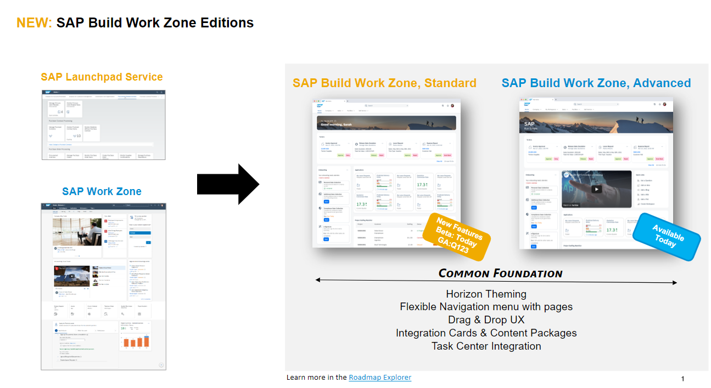

# DT264 - Learn How to Set Up and Configure SAP Mobile Start with SAP S/4HANA

## Description

This repository contains the material for the SAP TechEd 2022 session called DT264 - Learn How to Set Up and Configure SAP Mobile Start with SAP S/4HANA.

## Overview

The SAP Mobile Start app is your native entry point to SAP’s mobile universe.
Discover how to set up and configure SAP Mobile Start with SAP S/4HANA and how to add your native apps. You will understand all the prerequisites and necessary steps.

> **NOTE:** *SAP Launchpad Service* is part of the SAP Build portfolio. In early 2023, we launch a new experience with the new name **SAP Build Work Zone, Standard**. You can learn more in the [Roadmap Explorer](https://roadmaps.sap.com/board?PRODUCT=73554900100800003081&PRODUCT=73555000100800002781&range=CURRENT-LAST#Q3%202022). Please be aware that some screenshots or systems in this Hands-on material might still contain the former name.
>     

## Requirements

The requirements to follow the exercises in this repository are:

- SAP BTP Subaccount with SAP Build Work Zone, Standard* entitlement
- Admin access for this subaccount
- SAP S/4HANA system connected to the SAP BTP Subaccount
- Content Exposure set up for the SAP S/4HANA system
- Roles assigned to the user in SAP S/4HANA matching the exposed content
- A mobile phone (iOS or Android) capable of running SAP Mobile Start

## Exercises

> **NOTE:** For the SAP TechEd 2022 Hands-on Session we have already prepared the landscape with **SAP Build Work Zone, Standard***. Please start directly with [Exercise 1](../ex1) as an in-person participant.

- [Exercise 0 - Access SAP Build Work Zone, Standard](exercises/ex0/) (skip on TechEd 2022 Hands-on)
- [Exercise 1 - Create a Content Channel to import SAP S/4HANA Content](exercises/ex1/)
- [Exercise 2 - Create own content in Site Manager](exercises/ex2/)
- [Exercise 3 - Create Native App Tile for SAP Mobile Start](exercises/ex3/)
- [Exercise 4 - Create News Feed Tile for SAP Mobile Start](exercises/ex4/)
- [Exercise 5 - Configure Voice Commands for SAP Mobile Start on Apple iOS](exercises/ex5/)

## How to obtain support

Support for the content in this repository is available during the actual time of the online session for which this content has been designed. Otherwise, you may request support via the [Issues](../../issues) tab.

## License

Copyright (c) 2022 SAP SE or an SAP affiliate company. All rights reserved. This project is licensed under the Apache Software License, version 2.0 except as noted otherwise in the [LICENSE](LICENSES/Apache-2.0.txt) file.

## Footnotes

\* *SAP Launchpad Service* is part of the SAP Build portfolio. In early 2023, we launch a new experience with the new name **SAP Build Work Zone, Standard**. You can learn more in the [Roadmap Explorer](https://roadmaps.sap.com/board?PRODUCT=73554900100800003081&PRODUCT=73555000100800002781&range=CURRENT-LAST#Q3%202022).
