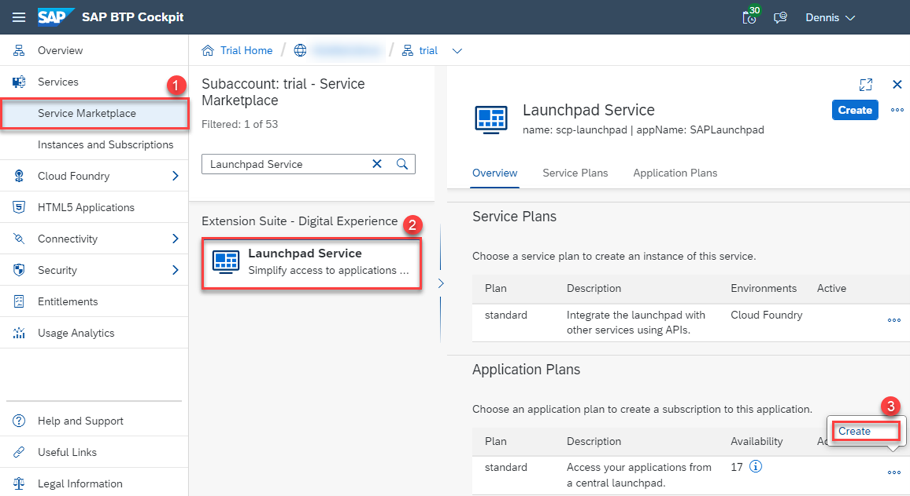
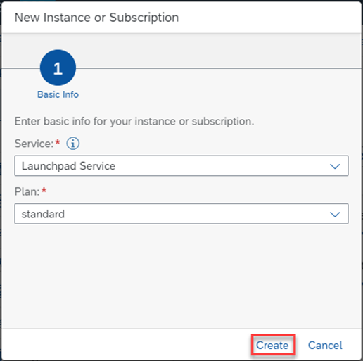
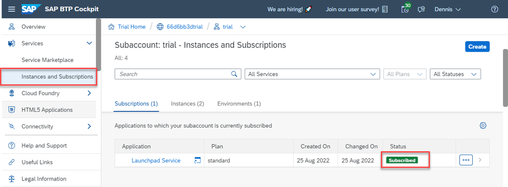
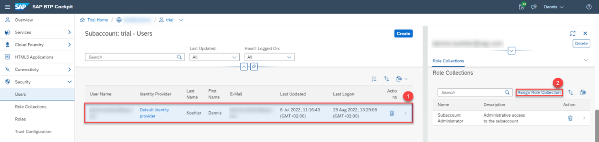
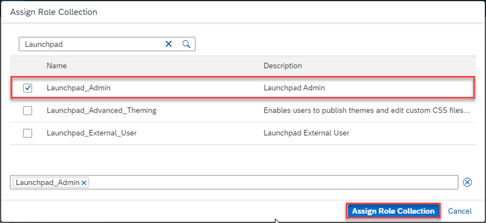
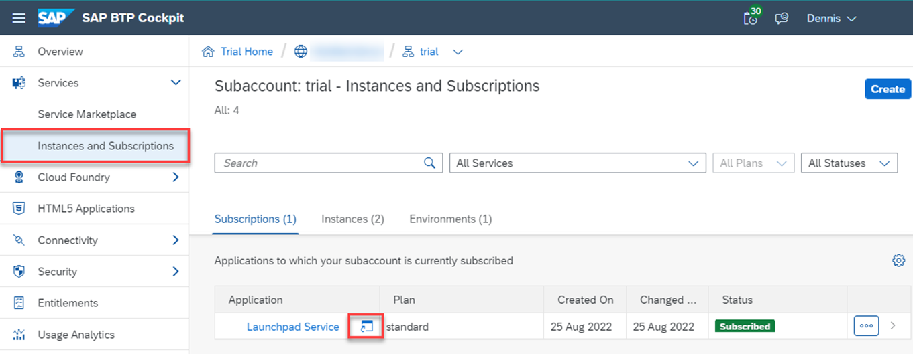
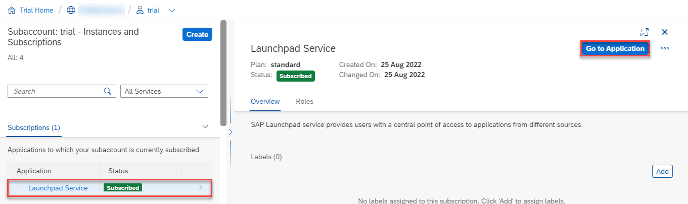
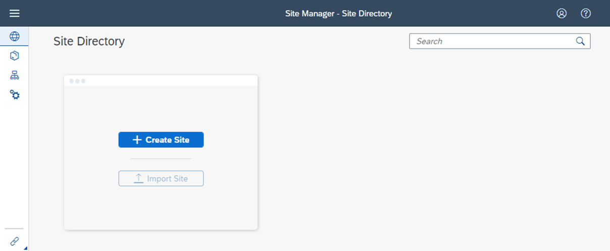

# Access SAP Build Work Zone, Standard

> **NOTE:** The steps of this exercise was already executed for your user for the SAP TechEd 2022 Hands-on Session. Please continue with [Exercise 1](../ex1) as an in-person participant. You can refer to this exercise if you are doing the Hands-on Workshop outside of SAP TechEd 2022.  

## Prerequisites:

- SAP BTP Subaccount with *SAP Build Work Zone, Standard*\* entitlement
- Admin access for this Subaccount

## Step 1: Create an "SAP Build Work Zone, Standard"* instance

1. Log into your SAP BTP Cockpit and select **Services > Service Marketplace**.

2. Search for “**Launchpad Service**”* and select the entry.

> **NOTE:** The entry in the Service Marketplace might be available under the new name *SAP Build Work Zone, Standard*\* for you. The screenshots below do contain the former name *SAP Launchpad Service*.

3. In the **Application Plans** section choose the 3 dots for the standard plan and click **Create**.

  

    
  

4. In the **New Instance or Subscription** dialog box that opens, keep the default information that is displayed and click **Create**.

  

    
  

5. After that, another popup confirms that your subscription is being created. Click **View Subscription** to navigate to the **Instances and Subscriptions** tab. After a few seconds of processing you should see that the service status has changed to "**Subscribed**".

  

## Step 2: Add the Launchpad_Admin Role Collection to your User

Adding the **Launchpad_Admin** Role Collection to a user allows them to access the admin application (also known as Site Manager). For users consuming the Site and it’s content later on the **Launchpad_External_User** role collcetion needs to be assigned.

1. Navigate to **Security > Users** and find your user in the list. Click on it to open the user details.

2. In the Role Collection section click on **Assign Role Collection**.

  

3. In the popup find and select the **Launchpad_Admin** role collection and click the **Assign Role Collection** button on the bottom right.

  

 > **NOTE:** You might need to wait a few minutes or perform a re-login to the SAP BTP Cockpit for the new role collection to become active. Before that you might face an Access Denied error if you try to access the application.

## Step 3: Access the "SAP Build Work Zone, Standard"* Site Manager

The Site Manager is an admin application for creating and maintaining Sites and content.

1. Navigate to **Services > Instances and Subscriptions** and find the service entry in the **Subscriptions** tab.  You can either directly click the small icon within the list entry or open the entries detail page to see the **Go to Application** button on the top right.

  

  

2. You should now see the **Site Manager**. You can navigate to different tabs via the navigation pane on the left. \
*(**Hint:** You might want to bookmark the URL, so you don’t have to open it via the BTP Cockpit in the future)*

  

Within the Site Manager there are three main pages available:

**1.  Site Directory:**
    Here you will create & maintain different sites and their settings.

**2.  Content Manager:**
    This is where the content is maintained; for e.g. you can see federated content from your SAP LoB solutions or you can manually create Apps (Tiles), Roles, Groups & Catalogs.

**3.  Channel Manager:**
    Content Channels  are used to import content from different source systems; for e.g. SAP S/4HANA. Via this tab you can create & maintain Content Providers.

## Footnotes

\* *SAP Launchpad Service* is part of the SAP Build portfolio. In early 2023, we launch a new experience with the new name **SAP Build Work Zone, Standard**. You can learn more in the [Roadmap Explorer](https://roadmaps.sap.com/board?PRODUCT=73554900100800003081&PRODUCT=73555000100800002781&range=CURRENT-LAST#Q3%202022).
