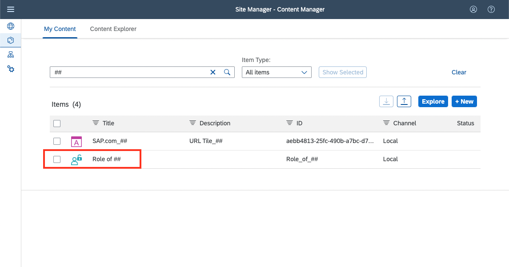

# Create own content in Site Manager

## Prerequisites:

- SAP BTP Subaccount with SAP Build Work Zone standard instance enabled
- Admin access for this subaccount
- Assignment of Launchpad_Admin role collection to access the Site Manager

## Step 1: Create your first App (URL Tile)

1. Navigate to the **Content Manager** tab on Site Manager, then click the **+ New** button and select **App** from the dropdown list.

    

    
    

2. A separate view for Tile Configuration will open. In the **Properties** tab you can enter the values that are given below. Make sure to mark all your created Apps, Groups, etc.; *replace the ## placeholders mentioned in the tutorial with your assigned number*.

    |Name|Value|Description|
    | ----------------- | ----------------------------------------------------- | ------------------------------------ |
    | Title             | `SAP.com_##`   (*use your number instead of ##*)   |Title you will see on top of the tile.|
    | Description       | `URL Tile_##`  	(*use your number instead of ##*) |Additional info to describe your app. This is shown in the Site Managers app list.|
    | Open App          | Select **In a new tab**                               |Defines whether an app is opened in place within the Launchpad shell or in a new browser tab. For URL Tiles we use In a new tab. |
    | System            | No System                                             |Field to define the connected backend system an app is running on. In this case no system is used / needed.|
    | App UI Technology | URL                                                   |Defines type of App. In this case a tile pointing to an URL. |
    | URL               | `https://sap.com`          |URL the tile should open|

    It should look like this:
    

      
    

3. Switch to the **Navigation** tab and fill in the values.

    |Name|Value|Description|
    | ----------------- | ------ | ------------------------------------ |
    | Semantic Object   | `app`    | Semantic object parameter for Intent navigation. Value does not matter in this context. |
    | Action            | `launch` | Action parameter for Intent navigation. Value does not matter in this context. |

    >**NOTE:** These values are required for apps that make use of intent-based navigation and not relevant for this URL tile. However they need to be entered as they are mandatory fields.

    It looks like this:
    

      
    

4. Switch to the Visualization tab to define the look of your tile. This is an optional step. You will see a preview on the top right. The following values are the most important for now:

    | Name | Value | Description |
    | ----------------- | ----------------------------------------------------- | ------------------------------------ |
    | Subtitle          | *Some subtitle…*                                                           | The Subtitle is shown on your tile underneath the title. |
    | Information       | *Some information…*                                                        | The information text is shown on the bottom of your tile. |
    | Icon              | Select an icon from the list via the icon on the right of the input field. | Defines the Icon that is shown in the tile.  |
    | Supported Devices | Leave all fields checked.                                                  | With the Supported Devices checkboxes you can define, whether an app is available for the different device types. |

    It should look like this:

    

      
    

5. Save the Tile via the button on the top right & return to the content manager. In a subaccount with a lot of items, you can search for your app by using title & description.
    (***Hint**: you can use your ## number to do that*)

## Step 2: Find your own Role and assign your App to it

> **NOTE:** For the SAP TechEd 2022 Hands-on Session, a role has already been created and assigned to you. You just need to assign your freshly created App to your role. When executing this tutorial outside of TechEd, it might be required to create a new Role or reuse an existing one.

1. Back in the **Content Manager** search for your number to locate the Role that has been created for you. (*Make sure to use your number ## for identification*)

    

      
    

2. Click on the entry to open it, click Edit afterwards on the top right.

3. Once done, you can add your app in the **Assignments** pane on the right. You can use your ## to find it, then press the **+ icon** to add it to your role.

    

      
    

4. Make sure to Save your role via **Save**. Once your role is saved it will be created as a Role Collection in the SAP BTP Cockpit.

> **NOTE:** For the SAP TechEd 2022 Hands-on Session, the role has already been assigned to you. When executing this tutorial outside of TechEd, you need to assign the role to the applicable users in the SAP BTP Cockpit (like in the previous exercise).
  
## Step 3: Create your own Group and assign your App to it

Apps will only show directly on the Launchpad / within SAP Mobile Start if they are assigned to a **Group** (see image below). If not, they are only available via the App finder on Desktop or the search in SAP Mobile Start.

     

Use the below steps to assign your app to a **Group**:

1. To create a new Group, navigate back to the Content Manager, click the **+ New** button and select **Group**.
    
    

     
    

2. Add a Title and Description. (Make sure to use your number ##)

    | Name | Value | Description |
    | ----------- | ------------------ | ------------------------------------ |
    | Title       | Group of ##         | Defines the name of your Group. |
    | Description | E.g. My first Group | Additional info to describe your Group. This is shown in the Site Managers app list. |

3. Then search for and assign your App on the right side with the assignments pane.

     

     
     

4. Make sure to **Save** your Group. 

## Step 4: Open your Site

1. Back in the Site Directory you can search for your Site and then open it via the **Go to Site** icon, highlighted in the screenshot below.

    

    
    

2. You should see your Group and Tile. Click your Tile and a new tab should open showing SAP’s website.

    

    
    

### Summary on Item relationship

It might be confusing to understand how the created items interact with each other. See the below diagram for additional clarification of the assignments.

## Troubleshooting

 1. You don’t see the Group / Tile on your Launchpad Site:
      - It’s possible the Role Collection assignment to your user is not yet active. Make sure your User has the new Role Collection assigned and log out / in again.
      - Maybe you missed one of the assignments while creating the Role, Group or Site.

 2. Clicking on the Tile results in an error:
      - You probably missed to change the Open App setting to Open in new tab. Since websites often prevent embedding, this can lead to problems.
