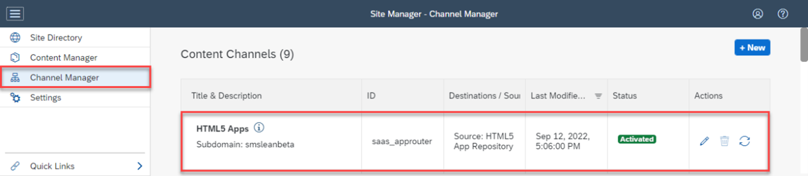
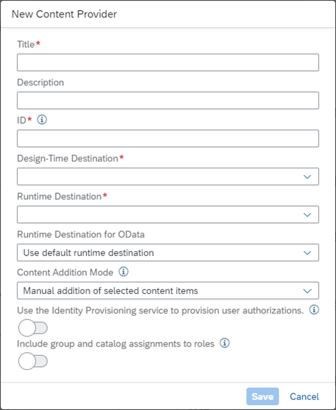
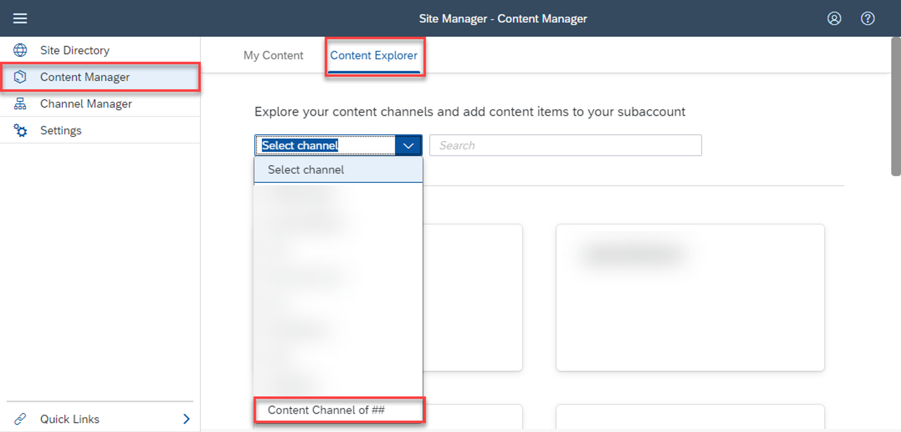
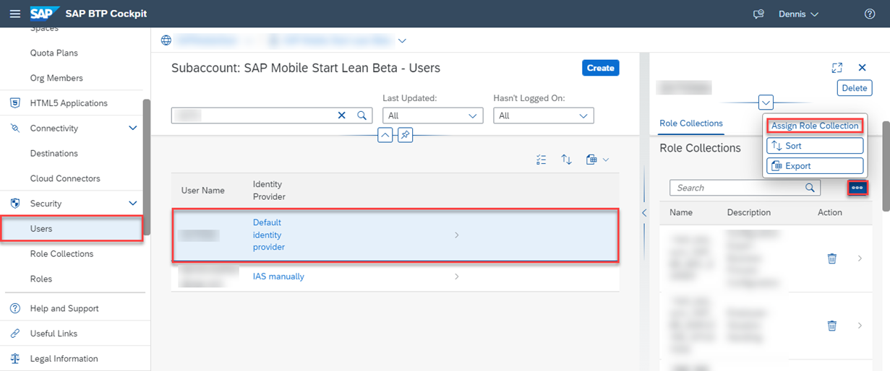
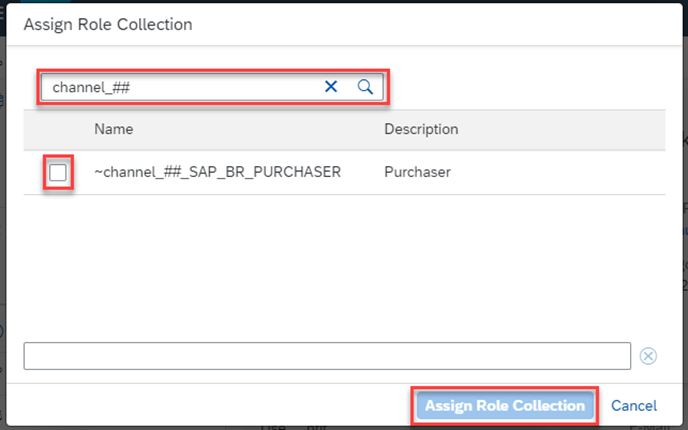
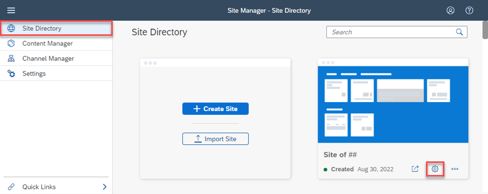
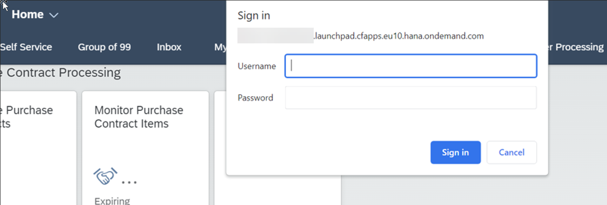

# Create a Content Channel to import SAP S/4HANA Content

## Prerequisites:

- SAP BTP Subaccount with SAP Launchpad service instance enabled
- Assignment of Launchpad_Admin role collection to access the Site Manager
- SAP S/4HANA System connected to the SAP BTP Subaccount
- Content got exposed from the SAP S/4HANA System
- Destinations pointing to this SAP S/4HANA System for both Run-Time and Design-Time
- End-user needs to have a matching User on the SAP S/4HANA System with fitting authorizations for the exposed content.

## Step 1: Create a Content Channel

1. Navigate to the **Channel Manager** tab within Site Manager

    

    
    

    You will see a list of all existing Content Channels available. In a blank SAP Launchpad service instance, there would only be one entry for **HTML5 Apps**. This is a default channel that can be used to import apps that are deployed directly to the SAP BTP subaccount's HTML5 repository.

2. Create your own Content Channel by clicking the **+ New** button in the top right. In the upcoming popup you can define the technical details. Fill in the values as given below:

    |Name|Value|Description|
    | ----------------------- | ----------------------------------------------------- | ------------------------------------ |
    | Title                   | Content Channel of ## (*use your number instead of ##*) | Name / Title of Content Channel – often similar to the name of the provider system |
    | Description             | -                                                       | Optional field for further description |
    | ID                      | Channel_## (*use your number instead of ##*)            | ID of Content Channel - gets auto filled based on Title (max 20 characters) |
    | Design-Time Destination | **TBD**                                                 | Design-Time destination of provider system - based on configured Destinations in the Subaccount|
    | Runtime Destination     | **TBD**                                                 | Runtime destination of provider system – based on configured Destinations in the Subaccount |
    | Runtime Destination for OData | Use default runtime destination                   | Some provider systems require a special destination for OData calls |
    | Content Addition Mode   | Manual addition of selected content items               | Defines if you can manually select content you want to add to your Site Manager or if all the provided content should be added automatically |

    It should look like this: **EDIT SCREENSHOT HERE**

    

    
    

3. Save your Content Channel.

## Step 2: Manually add content from your Content Channel

1. Navigate to the **Content Manager**. Next, you can switch to the **Content Explorer** tab and select your own channel. You can either click the tile or select it from the dropdown.

    

    
    

2. You should now see a list of roles that were imported via the Content Provider. You can select the different roles and then click the **+ Add to my Content** button on the top right.

    

    
    

    *PLACEHOLDER IMAGE*

3. Like your manually created Role in the last tutorial, the imported SAP S/4HANA Roles will be created as Role Collections in the SAP BTP Cockpit. To see the content within your Site later you need to Assign the Role Collection to your User in the BTP Cockpit:

    Navigate to **Security > Users**, search for your User and press the Assign Role Collection button.

    

    
    

    In the Popup search for the ID of your Content Channel e.g. “channel_##” and select the imported role to assign it.

    

    
    

    You might have to logout / login again for the new Role assignment to become active for your user.

    >**NOTE:** It’s also possible to archive this the other way around, by adding your User to the Role Collection. For that navigate to **Security > Role Collections**, find your imported Role Collection by searching for your Channel ID (“channel_##”) and click on it. Press the Edit button on the top right and enter your user info in the **Users** section.

4. Back in the Site Manager the imported roles will show up in the My Content list and can be added to your Site. For that navigate to the Site Directory, find your Site and choose the Settings icon.

    

    
    

5. Press the Edit mode, then search for the role you want to add in the **Assignments** pane. Roles can be available multiple times, coming from different Content Providers. You see the Content Providers ID below the Role.

    

    
    

    *Placeholder Image*

6. You can now open/refresh your Site and see the added content. In SAP Mobile Start you can pull down to refresh the content.

## Step 3: Troubleshooting

1. You don’t see the Groups / Tiles on your Launchpad Site:
    - It’s possible the Role Collection assignment to your user is not yet active. Make sure your User has the new, imported Role Collection assigned and log out / in again.
    - Maybe you missed one of the assignments of the imported Role to your Site

2. Accessing your Site and scrolling through it, raises an authentication popup:

    

    
    

    This is an indicator that the connection & authentication flow to your SAP S/4HANA system has an issue. There could be different reasons for that, e.g.:

    - Connection between your Subaccount & the SAP S/4HANA system is not configured properly
    - There might be no matching backend user to the IAS/BTP User
    - The Backend user is missing the authorization to work with the exported content
