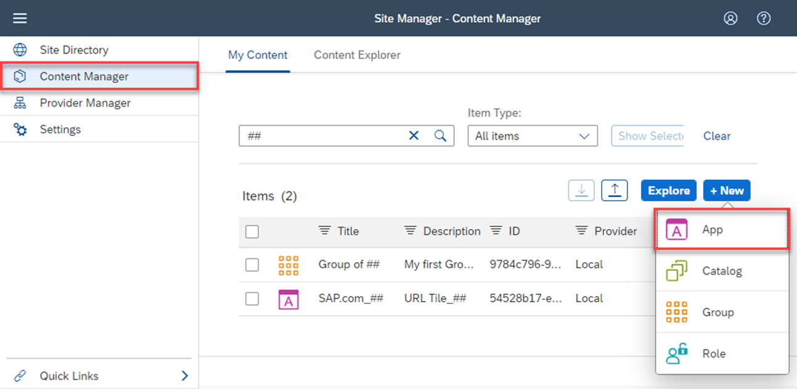
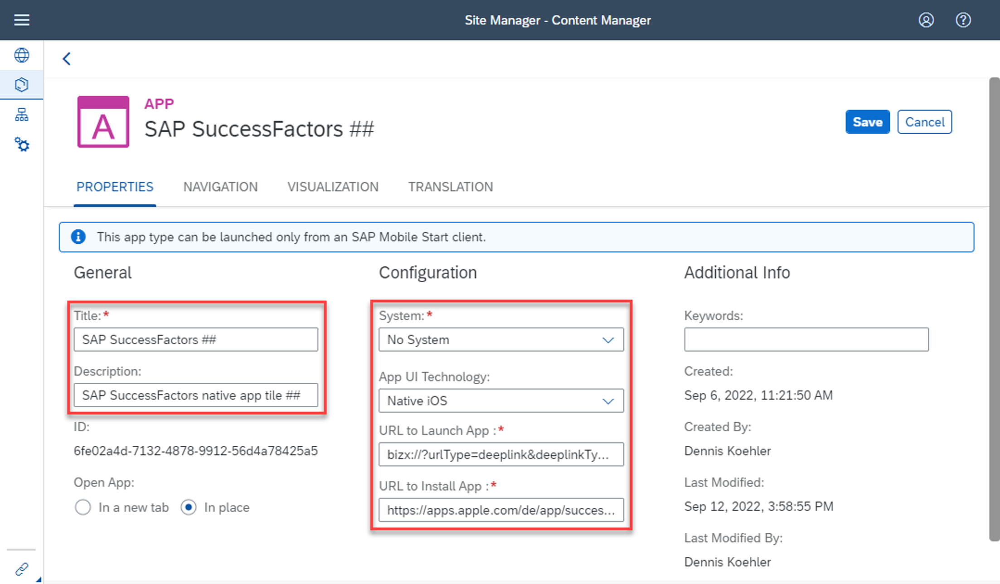
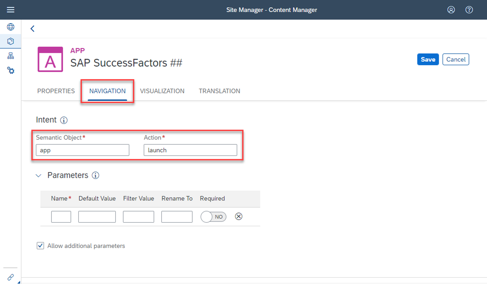
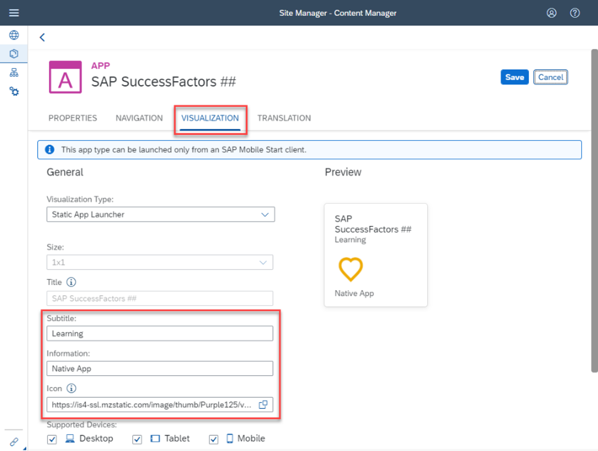
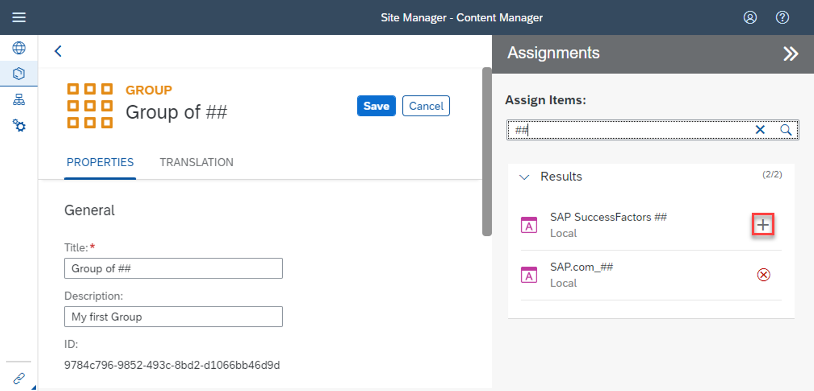
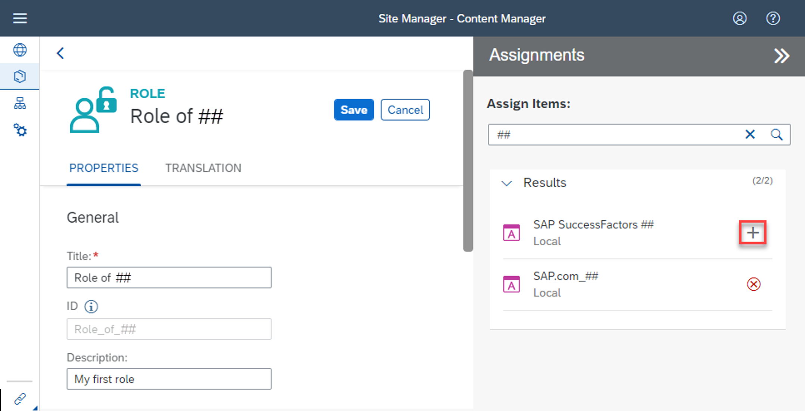
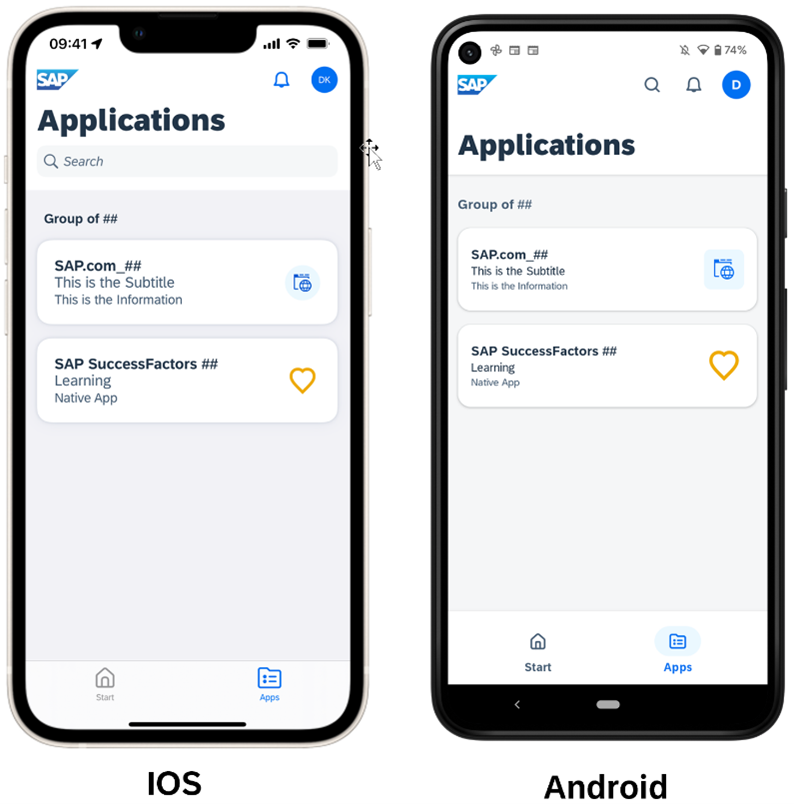

# Create Native App Tile for SAP Mobile Start 

## Prerequisites: 
  -	SAP BTP Subaccount with SAP Launchpad service instance enabled
  -	Assignment of Launchpad_Admin role collection to access the Site Manager

## Step 1: Create the Native App Tile (example for SAP SuccessFactors)

1.	Within Site Manager navigate to the **Content Manager** tab and create a new App via **+ New > App**
    
    

    
    

2.  Starting in the **Properties** section you can enter the values below. As an example, in this Tutorial the SAP SuccessFactors native app will be used. This app has the possibility to configure deep links to not only open the native app, but directly navigate to a specific screen. 
   
    |Name|Value|Description|
    | ----------------- | ----------------------------------------------------- | ------------------------------------ |
    | Title             | SAP SuccessFactors ##   (*use your number instead of ##*)                 | Title you will see on top of the tile |
    | Description       | SAP SuccessFactors native app tile ##   (*use your number instead of ##*) |Additional info to describe your app. This is shown in the Site Managers app list.|
    | System            | No System                                             | Field to define the connected backend system an app is running on. In this case no system is used / needed.|
    | App UI Technology | Native IOS or Native Android (based on your device)   | Defines type of App. In this case a native app tile for SAP Mobile Start. |
    | URL to Launch App | bizx://?urlType=deeplink&deeplinkType=launchApp       | URL-Scheme that allows opening an app, if it’s installed on the device. (The native App is expected to implement an URL-Scheme so that it can be launched by other apps.)  |
    | URL to Install App| For IOS:   https://apps.apple.com/de/app/successfactors/id426562526       For Android:   https://play.google.com/store/apps/details?id=com.successfactors.successfactors&hl=en&gl=US | Link to Apple App Store / Google Play Store based on selected UI Technology. In case the app is not installed you will get navigated to the relevant store mentioned in this field.  |
    

    **Note on Deeplinks:**
    For now, the used URL-Scheme (bizx://?urlType=deeplink&deeplinkType=launchApp) will just open the native app. With Deeplinks for SAP SuccessFactors it’s possible to directly navigate to specific screens within the native app. To archive this, you can try to replace the “launchApp” parameter with the following values: 
    
    | Link | Target | 
    | ----------------- | ----------------------------------------------------- | 
    | bizx://?urlType=deeplink&deeplinkType=**teamSpace**  | Will open the Team menu (if available) | 
    | bizx://?urlType=deeplink&deeplinkType=**goals**      | Shows the Objectives screen            | 
    | bizx://?urlType=deeplink&deeplinkType=**profile**    | Shows the users profile screen         | 
    |bizx://?urlType=deeplink&deeplinkType=**orgChart**    | Shows the Org Chart                    |
    
    The finished properties section should look like this: 
    
    

    
    

    
    
3.	Next, you need to fill the mandatory fields in the Navigation section. 
    
    |Name|Value|Description|
    | ----------------- | ------ | ------------------------------------ |
    | Semantic Object   | app    | Semantic object parameter for Intent navigation. Value does not matter in this context. |
    | Action            | launch | Action parameter for Intent navigation. Value does not matter in this context. |
    
    >**NOTE**: These values are required for apps that make use of intent-based navigation and not relevant for this URL tile. However, they need to be entered as they are mandatory fields.
    
    

    
    

    
    
4.	Lastly you can define the tile appearance within the Visualization section. You will see a preview on the top right. The following values are the most important for now: 

    | Name | Value | Description |
    | ----------------- | ----------------------------------------------------- | ------------------------------------ |
    | Subtitle          | e.g. “Learning”                                                          | The Subtitle is shown on your tile underneath the title. |
    | Information       | e.g. “Native App”                                                       | The information text is shown on the bottom of your tile. |
    | Icon              | Use the following URL for SAP SuccessFactors icon:   https://is4-ssl.mzstatic.com/image/thumb/Purple125/v4/84/79/72/847972bb-aa3f-c190-36bb-4a37f9c50449/AppIcon-1x_U007emarketing-0-6-0-85-220.png/230x0w.png | Icon that is shown in the tile. You can either select a standard icon from the input help or provide an URL to an image you want to use as an icon. For native apps it can be helpful to use the original app icon. |
    | Supported Devices | Not relevant - Leave all fields checked.      | This setting won’t have any effect, since Native App tiles will only be visible from SAP Mobile Start  |
   
    Here's how it looks: 
    
    

    
    

5.	Make sure to **Save** your App.  
 
    
## Step 2: Add the Native App tile to your Site

The same way as the URL tile in the previous tutorial, you need to assign your Native App to your Group & Role. Otherwise, it won’t be accessible in SAP Mobile Start. 

1.	Find your Group in the Site Manager, open it and choose **Edit**. In the Assignments section on the right, search for your newly created Native App tile “SAP SuccessFactors ##” and click the + icon. 

    

    
    

    
    Make sure to Save once you are done. 
    
2.	Repeat the same for your Role: 
    
    

    
    

    
    
## Step 3: Access your Native App tile on SAP Mobile Start
    
1.	Onboard your Site to SAP Mobile Start to see the new tile. If you’re already connected to your Site in SAP Mobile Start, you can perform a Pull to Refresh. After that the SAP SuccessFactors tile should show up:     
    
    

    
    

  
2.	Click on the tile to either:   

    a.	 Navigate to the App Store / Play Store, if the SAP SuccessFactors native app is not yet installed on your device. \
    b.	 or open the SAP SuccessFactors native app if it’s installed on your device. \
    c.	 In case you made use of one of the Deep link URL-Schemes for SAP SuccessFactors the respective screen should open. 

    >**NOTE:** If you don’t have an SAP SuccessFactors user, on IOS there is the possibility to use the Demo Mode of the SAP SuccessFactors app. Once enabled you can try the Deep links from SAP Mobile Start
