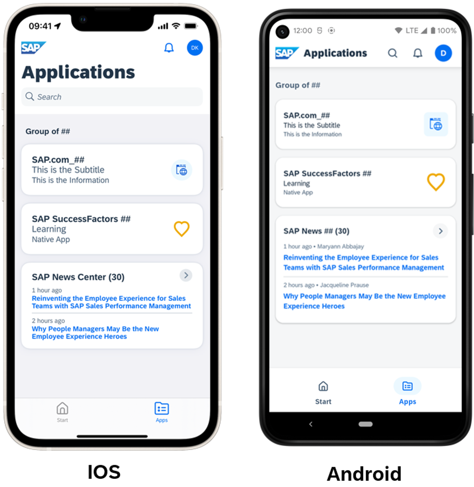

# Create News Feed Tile for SAP Mobile Start

## Prerequisites:

- SAP BTP Subaccount with SAP Build Work Zone standard instance enabled
- Assignment of Launchpad_Admin role collection to access the Site Manager

## Step 1: Create the News feed tile (example for SAP News)

1. Within Site Manager navigate to the **Content Manager** tab and create a new App via **+ New > App**

    

    
    

2. As an example, in this Tutorial the SAP News feed will be used. Unlike for the native apps there is no special App UI Technology for News feeds. You will use the Visualization parameters later to declare your app as a News feed for SAP Mobile Start. However, it’s possible to use the same app as an URL Tile on the desktop in parallel to have a link to the news webpage.

    You can enter the values below in the **Properties** section. Make sure to replace the ## placeholders mentioned in the tutorial with your assigned number.

    |Name|Value|Description|
    | ----------------- | ----------------------------------------------------- | ------------------------------------ |
    | Title             | `SAP News ##`   (*use your number instead of ##*)          | Title you will see on top of the tile |
    | Description       | `SAP News feed for ##`   (*use your number instead of ##*) | Additional info to describe your app. This is shown in the Site Managers app list.|
    | Open App          | Select **In a new tab**                                       | Defines whether an app is opened in place within the UI5 shell or in a new browser tab. For URL Tiles we use In a new tab. |  
    | System            | No System                                                     | Field to define the connected backend system an app is running on. In this case no system is used / needed.|
    | App UI Technology | URL                                                           | Defines type of App. In this case the News feed specific configuration for SAP Mobile Start is done in the Visualization parameters. Anyways it’s possible to use the same tile as an URL Tile in parallel on the desktop to point to the news URL. |
    | URL               | `https://news.sap.com/`                                         | URL for the app to navigate to on desktop.    |

    It will look like this:

    

    
    

3. Move on to the **Navigation** tab and fill in the values.
  
    |Name|Value|Description|
    | ----------------- | ------ | ------------------------------------ |
    | Semantic Object   | `news`   | Semantic object parameter for Intent navigation. Value does not matter in this context. |
    | Action            | `open`   | Action parameter for Intent navigation. Value does not matter in this context. |

    >**NOTE**: These values are required for apps that make use of intent-based navigation and not relevant for this URL tile. However, they need to be entered as they are mandatory fields.

    

    
    

4. Switch to the Visualization tab. Here you can define the appearance of your URL Tile for the desktop and define the parameters relevant for the SAP Mobile Start News feed.

    See the fields and values for the appearance below:

    | Name | Value | Description |
    | ----------------- | ----------------------------------------------------- | ------------------------------------ |
    | Subtitle          | *Some subtitle…*                                                           | The Subtitle is shown on your tile underneath the title. |
    | Information       | *Some information…*                                                        | The information text is shown on the bottom of your tile. |
    | Icon              | Select an icon from the list via the icon on the right of the input field. | Icon that is shown in the tile. |
    | Supported Devices | Leave all fields checked. (*You can uncheck Desktop if you don’t want to use it as a link to the news on desktop too*) | With the Supported Devices checkboxes, you can define, whether an app is available for the different device types.   |

    For the parameters section on the bottom of the Visualization section you need to enter the following parameter names and values.
    >**NOTE:** the parameter names are case sensitive.

    | Name | Value | Description |
    | ------------------- | ----------------------------------------------------- | ------------------------------------ |
    | `mobilestart.type`    | `news`                                                  | Defines the created app as a news feed for SAP Mobile Start |
    | `mobilestart.feedUrl` | `https://news.sap.com/feed/`   (*URL to SAP News feed in RSS 2.0 format*) | Defines the data source of your news feed. It needs to be an URL pointing to a news feed in RSS 2.0 format. |

    It should look like this:

    

    
    

5. Make sure to Save your app.

## Step 2: Add the Native App tile to your Site

With the same procedure as in previous tutorials, you need to assign your News feed tile to your Group & Role. Otherwise, it won’t be accessible for you on the Site and within SAP Mobile Start.

1. Find your Group in the Site Manager, open it and choose Edit. In the Assignments section on the right, search for your newly created News feed tile “SAP News ##” and click the + icon.
  
    

    
    
  

    Make sure to **Save**, once you are done.

2. Repeat the same for your Role:

    

    
    
  

    Make sure to **Save**, once you are done.

## Step 3: Access your Native App tile on SAP Mobile Start

1. Onboard your Site to SAP Mobile Start to see the new tile. If you’re already connected to your Site in SAP Mobile Start, you can perform a Pull to Refresh. After that the SAP News tile should show up

    

    
    

2. To make use of the News feed, you can either click directly on an article to open it or press the little (>) icon in the top right of the tile to show the whole list of articles. The News feed can also be used as a Widget. You will learn how to use a Widget in the next tutorial.

## Step 4: Make use of Widgets

SAP Mobile Start offer the possibility to add widgets to your phones home screen, based on the content within your site. \
Two different widget types are available:

- Business Info Widget: \
    The Business Info Widget holds monitoring tiles (the ones with a number on them). With that you can monitor the most important KPIs from your home screen. Clicking on the Widget will directly open the corresponding SAP Fiori app within SAP Mobile Start. 

- News Widget: \
    The News Widget allows you to bring news tiles to the home screen. You will be able see the latest articles and open them within SAP Mobile Start.

They could look like this:

  

  
  

To add SAP Mobile Start widgets to your home screen you can use the default iOS / Android widget functionality. Usually, you need to do a long press on an empty space of your home screen and select a + Icon or an Add Widget button. Then find SAP Mobile Start in the list of available options and select the Widget type you want to add. After that you will need to define the business app or a news feed as source for the specific Widget. On iOS one of the available sources is selected by default – you can edit it via a long press on the widget and clicking “Edit Widget”.

>**NOTE:** The use of Widgets allowed/prohibited by the landscape admins. There’s a flag available for that in SAP Mobile Services. You can find more info on Widgets in this [blogpost](https://blogs.sap.com/2021/09/03/sap-mobile-start-use-the-business-info-widget-to-monitor-your-business-directly-from-home-screen/). We have already enabled this in the tutorial landscape so that you can add a widget to your device.

## Troubleshooting

1. You don’t see the News Feed / URL Tile on your SAP Mobile Start app Site:
    - It’s possible the Role Collection assignment to your user is not yet active. Make sure your User has the new Role Collection assigned and log out / in again.
    - Maybe you missed one of the assignments you need to add the News feed app to your Group & Role.

2. Within SAP Mobile Start the News Feed Tile won’t load:
    - Likely one of the parameters is wrong. Make sure to enter them correctly and with respect to case sensitivity.
