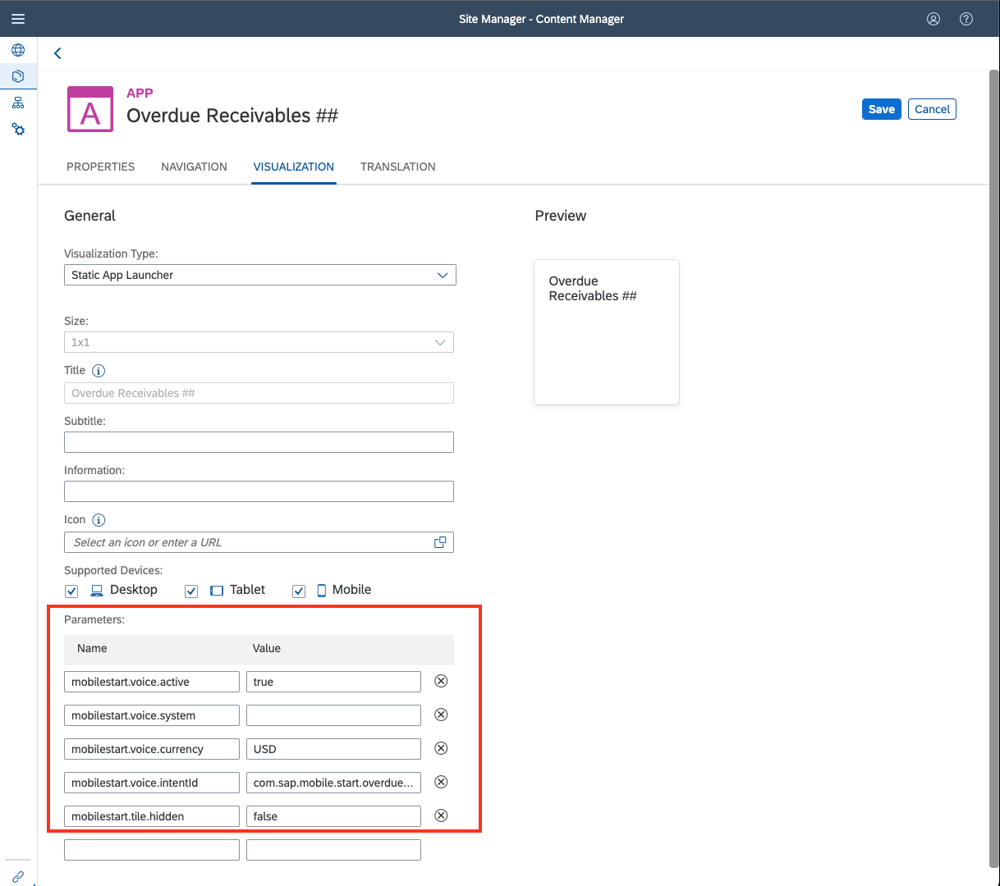

# Configure Voice Commands for SAP Mobile Start on Apple iOS

## Prerequisites:

- iOS Device with SAP Mobile Start
- SAP BTP Subaccount with *SAP Build Work Zone, Standard*\* instance enabled
- Assignment of Launchpad_Admin role collection to access the Site Manager
- SAP S/4HANA system connected to the SAP BTP Subaccount
- Destinations pointing to this SAP S/4HANA system for both Run-Time and Design-Time
- Roles assigned to the user in SAP S/4HANA

> **NOTE:** SAP Mobile Start currently only supports voice commands on the iOS App.
This tutorial is therefore only applicable to iOS users of SAP Mobile Start.
The two supported voice commands at the time of the creation of the tutorial are:
Overdue Receivables and Days Sales Outstanding within the Finance Persona.

## Step 1: Create the Voice Configuration tile

> **NOTE:** As an example, in this tutorial the Overdue Receivables Voice command will be configured.
You will use the Visualization parameters later to declare your app as a Voice Configuration for SAP Mobile Start.
For other devices than the iOS App of SAP Mobile Start, the app will be available as regular tile only.

1. Within Site Manager navigate to the **Content Manager** tab and create a new App via **+ New > App**

    

        
    

2. Enter the values below in the **Properties** Section. Make sure to replace the ## placeholders mentioned in the tutorial with your assigned number.

    |Name|Value|Description|
    | ----------------- | ----------------------------------------------------- | ------------------------------------ |
    | Title             | `Overdue Receivables ##`   (*use your number instead of ##*)   |Title you will see on top of the tile.|
    | Description       | `Voice Command for ##`   (*use your number instead of ##*) |Additional info to describe your app. This is shown in the Site Managers app list.| 
    | Open App          | Select **In place**  | Defines the app will be launched within the UI5 shell |
    | System            | `he4rt`  |Field to define the connected backend system an app is running on. In this case **he4rt** is used / needed.|
    | App UI Technology | SAPUI5 |Defines type of App. In this case the tile points to the Fiori App in the connected SAP system. |
    | SAPUI5 Component | `k1471533162136` | The SAP UI5 Component which can be found in the [SAP Fiori Apps Library](https://fioriappslibrary.hana.ondemand.com/sap/fix/externalViewer/#/detail/Apps('F1747')/S29)|

    

        
    

3. Move on to the **Navigation** tab and fill in the values.

    |Name|Value|Description|
    | ----------------- | ------ | ------------------------------------ |
    | Semantic Object   | `OverdueReceivablesKPI`    | Semantic object parameter for Intent navigation. |
    | Action            | `analyzeSBKPIOverdueReceivables` | Action parameter for Intent navigation. |

    |Name|Value|Description|
    | ----------------- | ------ | ------------------------------------ |
    | Parameter Name   | `EvaluationId`    | Parameter name passed to the SAP UI5 app. |
    | Parameter Default Value | `.SAP.FI.AR.OVERDUERECEIVABLES.TODAY` | Default value passed for the previously specified parameter name. |

    

        
    

> **NOTE:** The values maintained above are dependent on the desired SAP UI5 app to be launched. The principle is called **Intent Based Navigation** and offers to specify exactly which SAP Fiori / SAP UI5 App is being openend including (optional) initial parameters. Please consult the application documenatation or the application developer for further information regarding the specific values for a certain app target.

4. Switch to the **Visualization** tab.
Here you can define the appearance of your Overdue Receivables Tile for the desktop and define the parameters relevant for the SAP Mobile Start Voice command.
See the fields and values for the appearance below:

    | Name | Value | Description |
    | ----------------- | ------------------------------------- | ------------------------------------ |
    | Subtitle          | *Some subtitle…*  | The Subtitle is shown on your tile underneath the title. |
    | Information       | *Some information…*  | The information text is shown on the bottom of your tile. |
    | Icon              | Select an icon from the list via the icon on the right of the input field. | Defines the Icon that is shown in the tile.  |
    | Supported Devices | Leave all fields checked. (You can uncheck Desktop if you don't want to see it on desktop) | With the Supported Devices checkboxes you can define, whether an app is available for the different device types. |

5. For the parameters section on the bottom of the Visualization section
you need to enter the following parameter names and values:

    | Name | Value | Description |
    | ----------------- | ------------------------------- | ------------------------------------ |
    | `mobilestart.tile.hidden` | `false` | Defines whether this tile shall be hidden from the in-app screens of SAP Mobile Start. Can be set to true if you don't want this tile to show in SAP Mobile Start but still want to use it as Voice configuration. |
    | `mobilestart.voice.active` | `true` | Activates this Voice Configuration for SAP Mobile Start |
    | `mobilestart.voice.system` | `s4_fin` | Defines the runtime destination of the system from which the data is being accessed. |
    | `mobilestart.voice.currency` | `USD` | The currency in which the financial data is being requested |
    | `mobilestart.voice.intentId` | `com.sap.mobile.start.overduereceivables`| Defines to which voice command this configuration belongs |
    | `mobilestart.voice.visible.ios` | `true` | This property is only required for SAP Mobile Start version 1.3. You can ignore this if you are using version 1.4 or newer. See the [documentation](https://help.sap.com/docs/SAP_MOBILE_START/07837beb26804d719fbc7efa3f634ee0/920220cdff0043b8a5911aa53dacdb69.html?locale=en-US) for more info |

> **NOTE:** For the SAP TechEd 2022 Hands-on Session we are using a separate destination here for the data access. Usually it is the same as selected under the **Properties** section.

6. Don't forget to save your app

It should look like this:

    

## Step 2: Add the Voice Configuration tile to your Site

With the same procedure as in previous tutorials, you need to assign
your freshly created app for the Overdue Receivables voice command to
your Group & Role. Otherwise, it won't be accessible for you on the Site
and within SAP Mobile Start.

1. Find your Group in the Site Manager, open it and choose **Edit**.
In the Assignments section on the right, search for your newly created Voice Configuration tile `Overdue Receivables ##` and click the **+** icon. Make sure to **Save**, once you are done.

2. Repeat the same for your **Role:**. Make sure to **Save**, once you are done.

## Step 3: Finalize the Voice Configuration on iOS

1. Onboard your Site to SAP Mobile Start to see the new tile. If you're
    already connected to your Site in SAP Mobile Start, you can keep the
    session. If you set the property `mobilestart.tile.hidden` to
    `false`, your tile should appear after performing a Pull to
    Refresh.

2. To make use of the voice command, you need to finalize the
    configuration in the **Shortcuts** app on your iOS device. Open the
    Shortcuts app and click on the **+** on the top right to define a
    new shortcut. Choose **Overdue Receivables** as name.

    > **NOTE:**: The chosen name will also be the trigger word(s) to start
    the voice command using Apple Siri. You can also choose a different
    name depending on your preferences.

3. Click on **Add action** and Search for **SAP Start**. Two actions
    should be displayed now in the list. Select **Overdue Receivables**
    for our example.

4. If you want, you can specify a fixed **Time Period** that shall be
    queried using the variable field displayed in the Overdue
    Receivables action. You can keep it **empty** or select **Ask every time** to select the desired Time Period during execution.

5. Click on the **x** icon at the top right to close the configuration
    screen

    
    

    
    

## Step 4: Use the Voice Command

1. You can invoke the command using multiple approaches. One option is
    to hit the shortcut tile within the Shortcuts app. This will start
    executing it.

    

2. You can also add it to your Home Screen on iOS using the **share**
    button within the configuration view. It can be opened again using
    the **three dots** when being at the **All Shortcuts** overview
    page. Within the **Share Sheet,** you can select **Add to Home
    Screen**.

    
    

3. You can also invoke it using Apple Siri and the chosen name of the
    shortcut

    
    

## Congrats

Wow, looks amazing! You have completed the last exercise. 🥳

You can now navigate to the [Overview](../).

## Footnotes

\* *SAP Launchpad Service* is part of the SAP Build portfolio. In early 2023, we launch a new experience with the new name **SAP Build Work Zone, Standard**. You can learn more in the [Roadmap Explorer](https://roadmaps.sap.com/board?PRODUCT=73554900100800003081&PRODUCT=73555000100800002781&range=CURRENT-LAST#Q3%202022).
